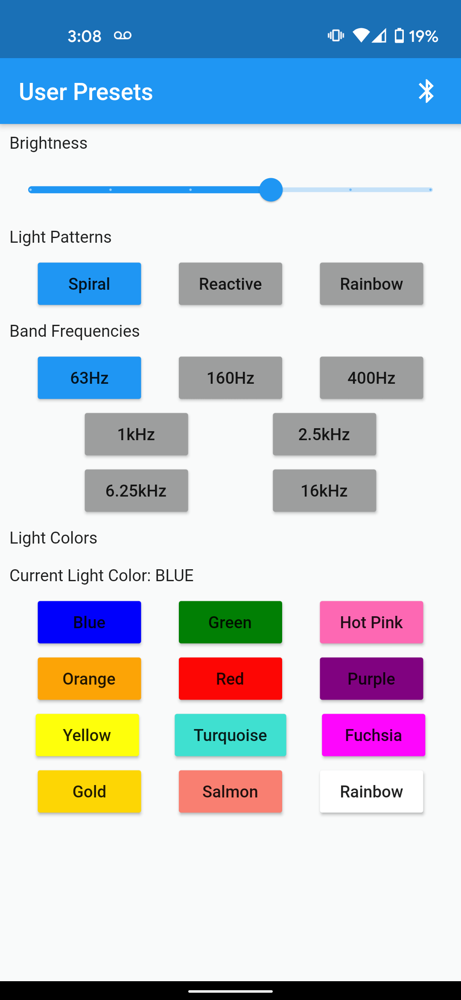

# SE 101 Project- LED Music Visualizer + App

Codebase for the LED Music Visualizer project, consisting of the flutter app and the Arduino code. The bluetooth-connected app provides an interface for the user to select from 3 presets and 12 colours for the LED strip to display. The reactive preset allows for the user to select from 7 audio frequency bands for the LED strip to react to based on music connected via aux cord to the Arduino Uno.
## Music Visualizer DEMO
https://www.youtube.com/watch?v=gql5rh0lM1U
<ul> 
  <h2>Timestamps:</h2>
  <li>1:00 ~ Spiral Preset</li>
  <li>1:45 ~ Rainbow Preset</li>
  <li>2:22 ~ React Preset (Music Visualizing Feature) </li>
  <li>3:00 ~ Music Visualizer controlled via Mobile App</li>
  <li>4:58 ~ Stages of Development</li>
</ul>

## Main Hardware Components

- Arduino Uno
- Sparkfun Spectrum Shield
- Individually Adressable LED Strip
- Bluetooth Module

## Main Software Components

- .ino Arduino code
- Cross-platform Flutter controller app using the flutter_blue plugin (https://pub.dev/packages/flutter_blue)

## App Functionalities:

- Change the brightness of the led strip
- Change the pattern of the light
- Change the frequencies of which the led strip responds to
- Change the colour of the light

## Contributors:

Uzair Ahmad, Dimitar Atanassov, Hanan Au, Jui Shah, Ximing Yang
